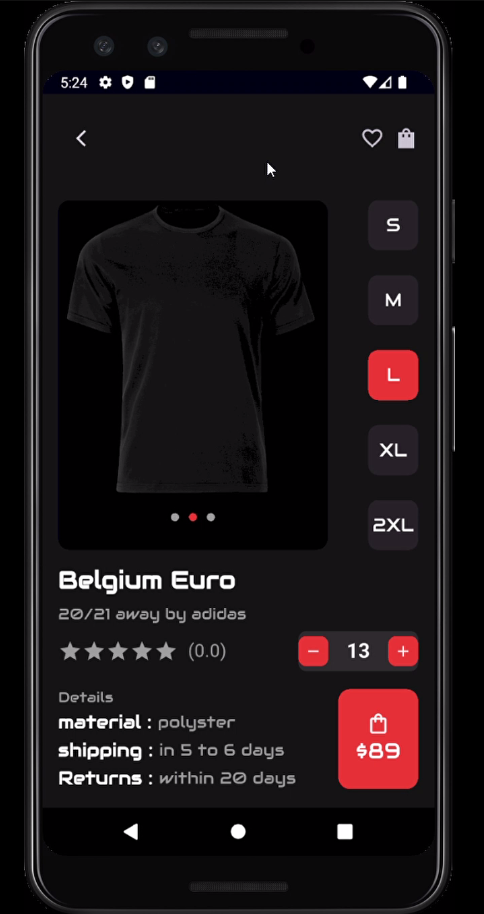

# 🛍️ Practical Break (2) - Product Details UI

## 📌 Task Title:
**Practical Break (2) - Product Details Page in Flutter**

---

## 📱 Screen Overview:

  

---

## 🔍 Screen Features:

-  Product image preview
-  Product name and brand
-  Rating & reviews
-  Size selection (S, M, L, XL, 2XL)
- Quantity adjustment buttons
-  Product details: Material, Shipping, Returns
- Price display with cart button

---

## 🛠️ Tech Stack:

- **Framework:** Flutter  
- **Language:** Dart  
- **State Management:** `setState`  
- **Theme:** Dark mode

