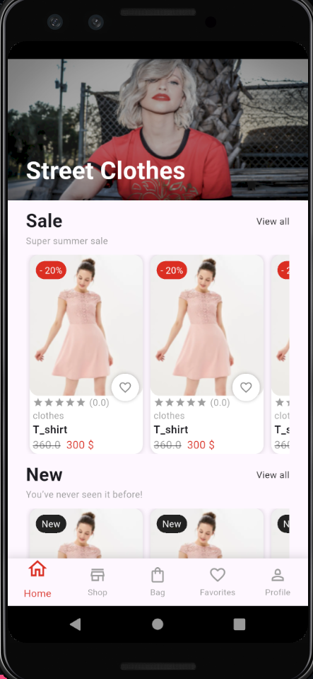
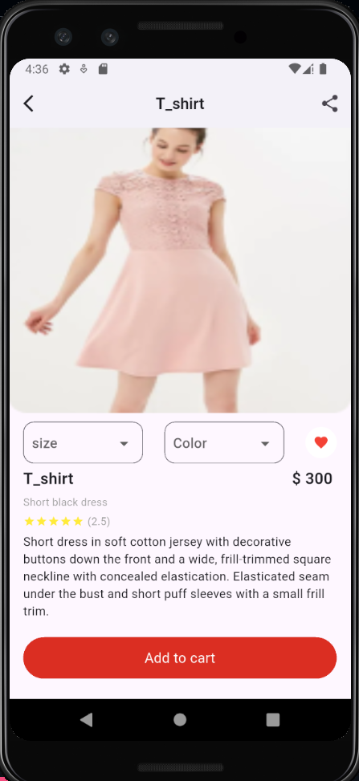

# 🛍️ E-Commerce App UI | Task 2 - IEEE ManSC Flutter Circle

This project was built as part of **Task 2(E_commerce_UI)** in the **Flutter Circle** at  
IEEE Mansoura Computer Society Chapter – *Practical Break E-Commerce*.

It focuses on building the **Home Screen** and **Product Details Screen** for an e-commerce app using Flutter.

---

## 📱 App Screens

### 🏠 Home Screen
Displays product sections like Sale and New Items, each with product cards showing name, price, discount, and a favorite icon.

  

---

### 📦 Product Details Screen
Shows detailed product information like image, size, color, price, rating, and description. Also includes "Add to cart" button and favorite toggle.

  

---

## 📂 Task Info

- 📆 **Week**: Practical Break E-Commerce 
- 📚 **Circle**: Flutter – IEEE Mansoura Computer Society Chapter (IEEE ManSc)  
- 📝 **Task**: Task 2 (E_commerce_UI)
- 🎯 **Goal**: Implement a UI based on a given design (Home & Product Details)

---

## 🛠️ Built With

- **Flutter**
- **Dart**
- **Stateful Widgets**
- **Basic Navigation (MaterialPageRoute)**

---

## 🙋‍♀️ Developed By

**Romisah Mohamed Fadel**  
*Flutter Circle Trainee - IEEE ManSC*

