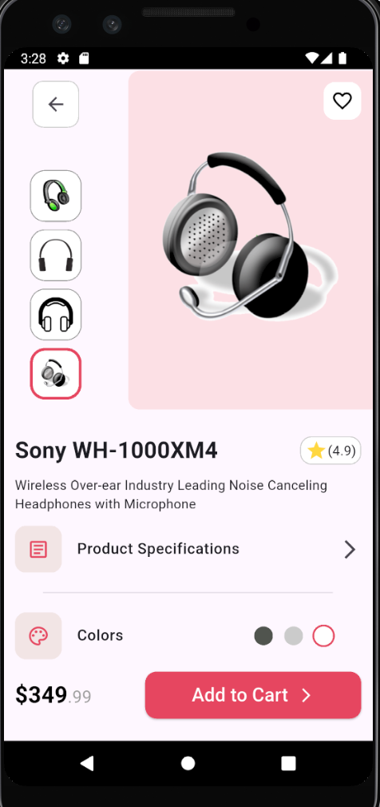

# 🎧 Final Project Screen - Beginner Level (IEEE ManSC)

This project represents the **Final Project Screen** at the **Beginner Level** in IEEE ManSC. It is a **Flutter-based UI design**, displaying a product with interactive features.

## 📸 Screenshot  

  

## ✨ Features  
✔ Multiple product images with selection effect  
✔ Color selection with a highlighted border  
✔ Modern & user-friendly UI  

## 🛠 Technologies Used  
- **Flutter**  
- **Dart** 

