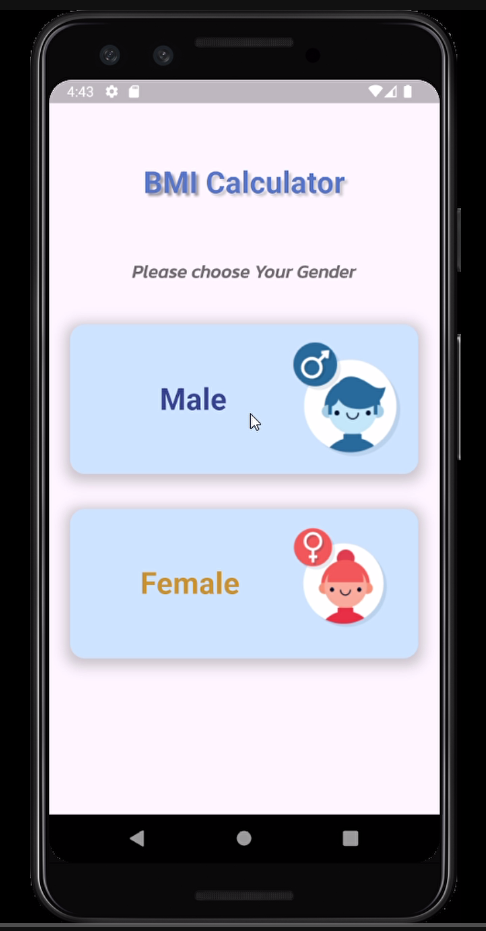
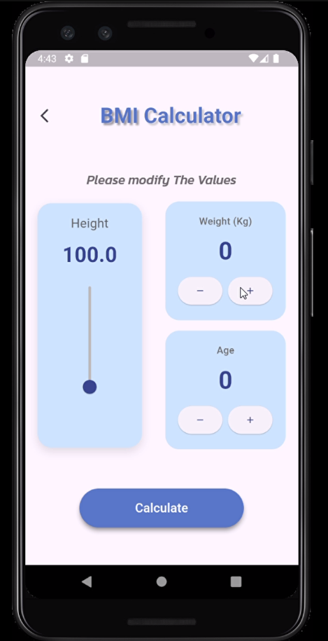
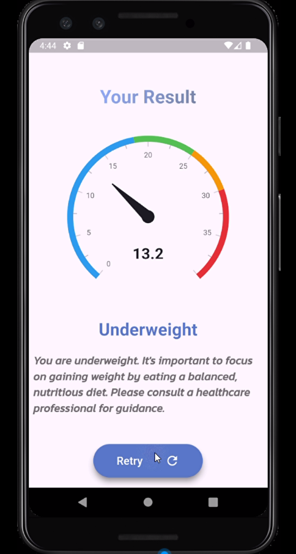

# BMI Calculator App

## 📌 Overview
The **BMI Calculator App** helps users determine their Body Mass Index (BMI) based on their weight and height. It provides an easy-to-use interface with a clean design and interactive features.

## 🛠 Features
- **Splash Screen**: A welcoming screen before the app loads.
- **Home Screen**: Users can input their weight and height to calculate BMI.
- **Modify Values**: Allows users to adjust their input values before finalizing.
- **Result Screen**: Displays the calculated BMI along with relevant health information.
- **Reset Functionality**: Users can reset their inputs and start a new calculation.

## 📸 Screenshots

  <table>
    <tr>
      <td></td>
      <td></td>
    </tr>
    <tr>
      <td><b>Splash Screen</b></td>
      <td><b>Home Screen</b></td>
    </tr>
    <tr>
      <td></td>
      <td></td>
    </tr>
    <tr>
      <td><b>Modify Values</b></td>
      <td><b>Result Screen</b></td>
    </tr>
  </table>

## 🔧 Technologies Used
- **Dart & Flutter**: For building the app.

## 🚀 How to Use
1. Open the app.
2. Enter your weight and height.
3. Click the **Calculate** button to get your BMI.
4. Modify values if needed.
5. Reset to start a new calculation.

